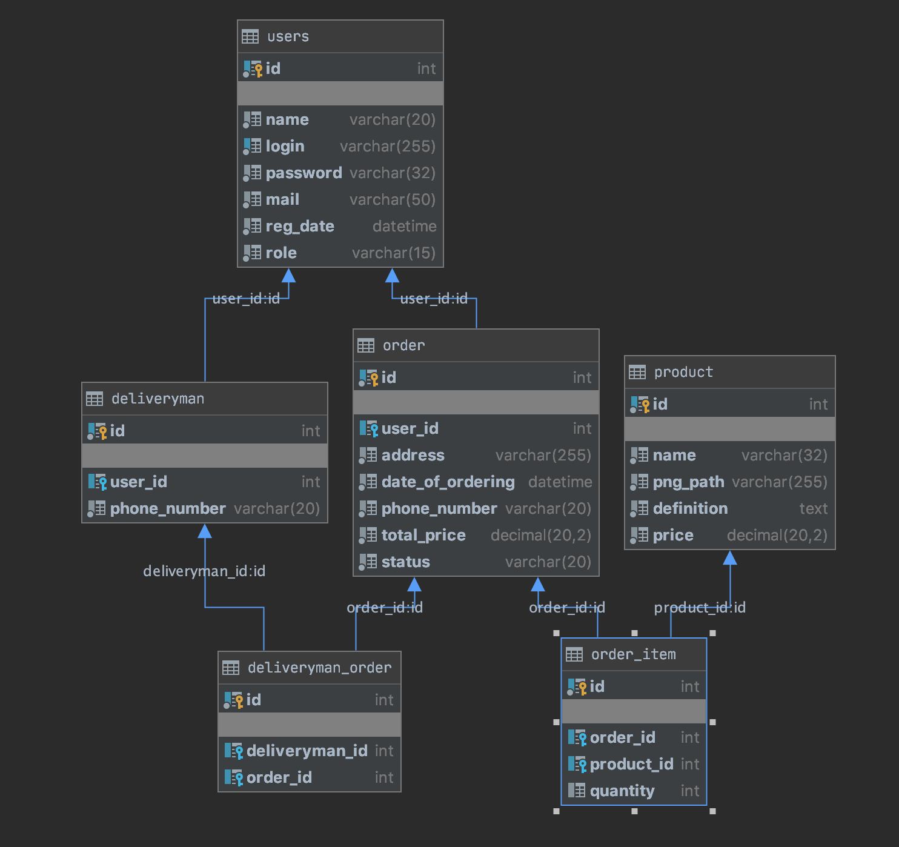

# final task:
##online service for ordering food at home
С помощью данного сервиса можно заказывать еду на дом;
В данном приложении существуют несколько ролей: `admin`(администратор), `deliveryman`(доставщик еды) и `user`(пользователь)
####пользователь может:
   * входить
   * регистрироваться в сервесе
   * просматривать список продуктов
   * смотреть информацию о продукте
   * добавлять в корзину продукт
   * удалять из корзины продукт
   * заказывать
   * отслеживать покупку
####администратор может:
   * добавлять товар
   * изменять товар
   * создавать доставщиков
   * просматривать товар
####администратор может:
   * просматривать новые заказы
   * принимать заказы
   * завершать выполнение заказа
##база данных

  